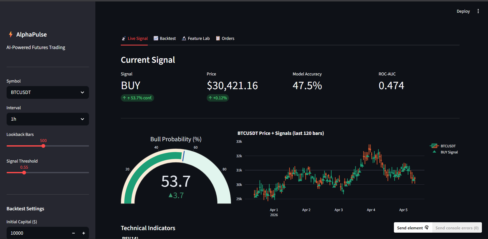
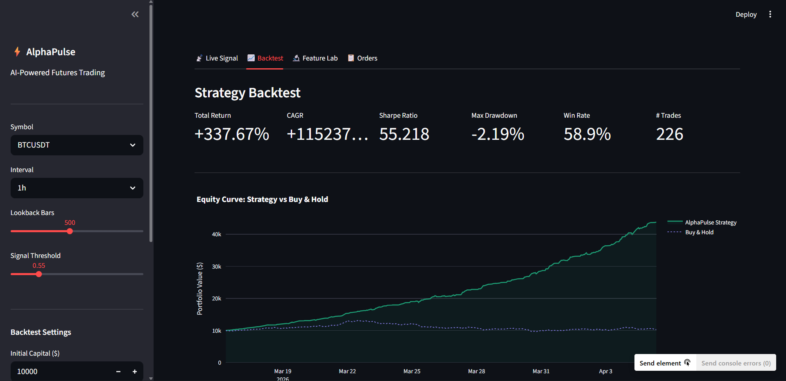
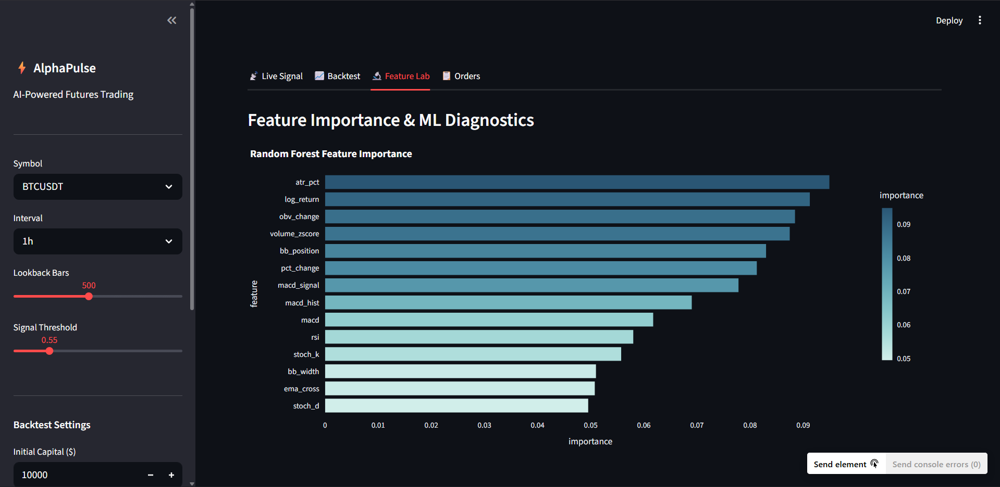

# ⚡ AlphaPulse — AI-Powered Crypto Futures Trading Bot

> A production-grade machine learning trading system built on Binance Futures, featuring real-time signal generation, walk-forward backtesting, and an interactive Streamlit dashboard.

---

## 📸 Screenshots

| Live Signal Dashboard | Backtest Equity Curve | Feature Importance |
|---|---|---|
|  |  |  |

---

## 🚀 Features

- **ML Signal Engine** — Random Forest classifier trained on 14 technical indicators, predicts next-bar direction with confidence scores
- **Walk-Forward Cross-Validation** — TimeSeriesSplit prevents data leakage, produces realistic out-of-sample accuracy
- **Full Feature Pipeline** — RSI, MACD, Bollinger Bands, ATR, Stochastic, OBV, EMA crossovers, volume z-scores
- **Vectorised Backtesting** — models transaction costs, slippage, drawdown; computes Sharpe, Sortino, win rate
- **Interactive Dashboard** — Streamlit app with live signal gauge, candlestick chart, equity curve, and order panel
- **Risk Management Layer** — pre-trade quantity limits, symbol allowlists, retry logic with exponential backoff
- **Modular CLI** — `signal`, `order`, and `backtest` subcommands

---

## 🏗️ System Architecture

```
alphapulse/
├── bot/
│   ├── client.py          # Binance Futures API client with retry logic
│   ├── orders.py          # OrderExecutor + RiskManager
│   ├── validators.py      # Input sanitization
│   └── logging_config.py  # Dual file+console logging
├── ml/
│   ├── features.py        # OHLCV → 14-feature engineering pipeline
│   └── model.py           # SignalModel (Random Forest / GBM)
├── backtest/
│   └── engine.py          # Vectorised backtester + performance metrics
├── dashboard/
│   └── app.py             # Streamlit 4-tab interactive dashboard
├── data/models/           # Persisted joblib model artifacts
├── logs/                  # trading.log
├── cli.py                 # Unified CLI entrypoint
└── requirements.txt
```

**Data flow:**
```
Binance API → OHLCV klines → Feature Engineering → ML Model → Signal (BUY/SELL + confidence)
                                                                    ↓
                                                        OrderExecutor (with RiskManager)
                                                                    ↓
                                                          Binance Futures Testnet
```

---

## 🧠 ML Component

**Model:** `sklearn.ensemble.RandomForestClassifier`
**Input:** 14 engineered features (see `ml/features.py`)
**Target:** Binary — 1 if next bar closes higher, 0 otherwise
**Validation:** 5-fold `TimeSeriesSplit` walk-forward CV

| Feature Group | Indicators |
|---|---|
| Returns | Log-return, % change |
| Momentum | RSI(14), MACD(12/26/9), Stochastic %K/%D |
| Trend | EMA crossover(9/21), Bollinger Band position |
| Volatility | ATR%, Bollinger Band width |
| Volume | OBV change, Volume z-score |

---

## 📊 Metrics

| Metric | Definition |
|---|---|
| **Sharpe Ratio** | Annualised risk-adjusted return |
| **Sortino Ratio** | Downside deviation adjusted return |
| **Max Drawdown** | Largest peak-to-trough loss |
| **Win Rate** | % of trades closed profitably |
| **Profit Factor** | Gross profit / Gross loss |
| **ROC-AUC** | ML classifier discrimination ability |

---

## ⚙️ Installation

```bash
# 1. Clone
git clone https://github.com/yourusername/alphapulse.git
cd alphapulse

# 2. Install dependencies
pip install -r requirements.txt

# 3. Configure environment
cp .env.example .env
# Edit .env and add your Binance Testnet API keys
```

**.env.example:**
```
BINANCE_API_KEY=your_testnet_api_key
BINANCE_API_SECRET=your_testnet_api_secret
```

---

## 💻 Usage

### 1. Streamlit Dashboard
```bash
streamlit run dashboard/app.py
```

### 2. Get ML Trading Signal
```bash
python cli.py signal --symbol BTCUSDT --interval 1h --lookback 500
```

### 3. Run Backtest
```bash
python cli.py backtest --symbol BTCUSDT --interval 1h --capital 10000
```

### 4. Place a Paper Order
```bash
# Market order
python cli.py order --symbol BTCUSDT --side BUY --type MARKET --quantity 0.01

# Limit order
python cli.py order --symbol ETHUSDT --side SELL --type LIMIT --quantity 0.1 --price 3200
```

---

## 🧪 Testing

```bash
pytest tests/ -v --cov=.
```

---

## 🔮 Future Improvements

1. **LLM Sentiment Analysis** — Integrate GPT-4 / FinBERT on live crypto news from NewsAPI to generate a sentiment score as an additional feature
2. **Reinforcement Learning Agent** — Replace the RF classifier with a PPO/DQN agent (Stable Baselines3) for end-to-end policy learning
3. **Portfolio Optimisation** — Multi-asset mean-variance optimisation with dynamic position sizing using PyPortfolioOpt
4. **Live Deployment** — Docker + cron job for scheduled signal refresh; webhook alerts via Telegram Bot API
5. **Model Drift Detection** — Monitor feature distributions with Evidently AI; retrain automatically when drift is detected

---

## 🛠️ Tech Stack

| Layer | Tools |
|---|---|
| Language | Python 3.11 |
| Exchange API | python-binance |
| ML | scikit-learn (Random Forest, GBM) |
| Feature Engineering | pandas, numpy |
| Backtesting | Custom vectorised engine |
| Dashboard | Streamlit, Plotly |
| Model Persistence | joblib |
| Testing | pytest, pytest-cov |
| Logging | Python logging (file + console) |

---

## � Author

Built by **[So-coder-ai]** | [GitHub](https://github.com/yourusername) | [LinkedIn](https://linkedin.com/in/yourprofile)

---

## �📄 License

MIT License — free to use and modify.

---

## 🤝 Contributing

Contributions are welcome! Please feel free to submit a Pull Request. For major changes, please open an issue first to discuss what you would like to change.

---

## ⚡ Quick Start

```bash
# Clone and setup
git clone https://github.com/yourusername/alphapulse.git
cd alphapulse
pip install -r requirements.txt

# Configure API keys
cp .env.example .env
# Edit .env with your Binance Testnet API keys

# Run the dashboard
streamlit run dashboard/app.py
```
